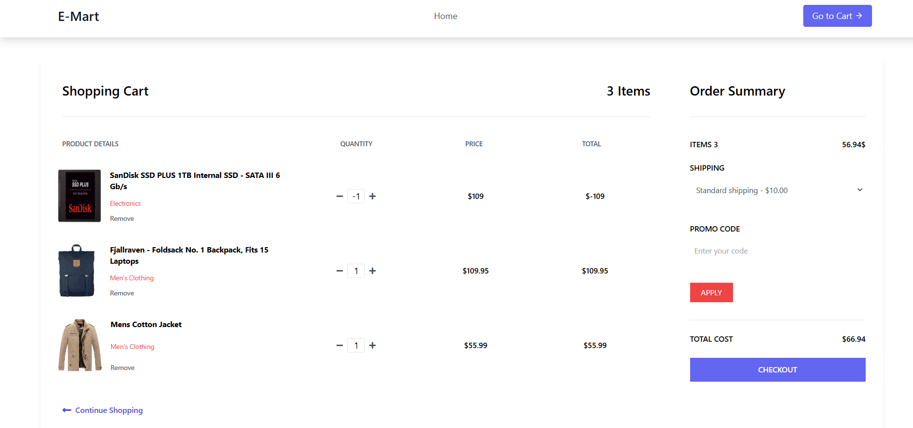

# E-Mart

## Project Description

Build an e-commerce store with a product listing page, add-to-cart functionality, a cart page that calculates total price and allows item removal, and manage the cart state globally using Context API or Redux.

The main features of this application include:
- Responsive layout with categories displayed in a grid.
- Easy navigation with React Router.
- Dynamic rendering of categories from an array of card data.

## Screenshots

Below is a screenshot of the project:
**Home Page**

**Productdetails Page**

**Cart Page**

## Technologies Used
- **React** - A JavaScript library for building user interfaces.
- **Tailwind CSS** - A utility-first CSS framework for creating custom designs.
- **React Router** - A library for declarative routing in React applications.

